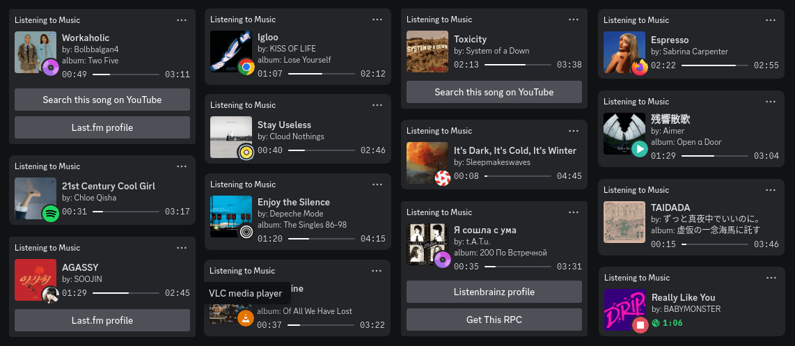

# mpris-discord-rpc



Linux Discord rich presence for music, using MPRIS with **album cover and progress bar support**. You can customize additional buttons, such as linking to your Last.fm profile or searching for the current song on YouTube. There's also an option to display either the music player's icon or your Last.fm avatar next to the album cover. The application is written in Rust.

## Supported players

Any player or app with [MPRIS](https://wiki.archlinux.org/title/MPRIS) support. Basically nearly every music application on Linux supports MRPIS in some way so there are plenty of compatible players. Web browsers also support MPRIS so this will work even with music streaming services playing in Google Chrome or Firefox.

## Requirements

Any fairly new 64-bit Linux distribution. It will probably also work on older versions of Linux but would have to be manually compiled on an older system. The optional background service and automatic startup capabilities rely on systemd.

## Installation

### Debian, Ubuntu, Mint and derivatives (.deb)

<details>
  <summary>Instructions</summary>

Download the latest .deb file from the [Releases](https://github.com/patryk-ku/mpris-discord-rpc/releases) page.

Now double-click it from file explorer to install it using Software Manager or use this command:

```sh
sudo dpkg -i mpris-discord-rpc.deb
```

</details>

### Fedora, openSUSE and derivatives (.rpm)

<details>
  <summary>Instructions</summary>

Download the latest .rpm file from the [Releases](https://github.com/patryk-ku/mpris-discord-rpc/releases) page.

Double-click the file in your file explorer to install it using your distribution's software manager.

Alternatively, you can use the following commands:

Fedora

```sh
sudo dnf install ./mpris-discord-rpc.rpm
```

openSUSE

```sh
sudo zypper install mpris-discord-rpc.rpm
```

</details>

### Arch, Manjaro, EndeavourOS and derivatives (AUR)

<details>
  <summary>Instructions</summary>

Available in the [AUR](https://aur.archlinux.org/packages/mpris-discord-rpc). Install with your favorite AUR helper:

```sh
yay -S mpris-discord-rpc
```

</details>

### Other Distributions

<details>
  <summary>Instructions</summary>

Download the latest executable from the [Releases](https://github.com/patryk-ku/mpris-discord-rpc/releases) page (just a `mpris-discord-rpc` file) and grant execute permissions:

```sh
chmod +x mpris-discord-rpc
```

You can now add the binary to your PATH or create an alias.  However, for the systemd service to function correctly after running `mpris-discord-rpc enable`, the file must be located at `/usr/bin/mpris-discord-rpc`.  Alternatively, you can modify the `ExecStart` path in the `~/.config/systemd/user/mpris-discord-rpc.service` file and restart the service with `mpris-discord-rpc restart`.

Alternatively, you can skip systemd and configure the binary to run on startup yourself, depending on your specific distribution and desktop environment.

</details>

> [!NOTE]
> If there is no package for your distribution and you have experience creating packages for it, you can open an Issue so we can work together to add it.

## Configuration and usage

For the basic default usage just run it in the terminal:

```
mpris-discord-rpc
```

You can change the default settings using arguments or by editing config file. Launch executable with `-h` or `--help` for aditional info:

```
mpris-discord-rpc --help

Usage: mpris-discord-rpc [OPTIONS] [COMMAND]

Commands:
  enable   Start RPC in the background and enable autostart
  disable  Stop RPC and disable autostart
  restart  Use to restart the service and reload the changed configuration file
  help     Print this message or the help of the given subcommand(s)

Options:
  -i, --interval <seconds>            Activity refresh rate (min 5, default 10)
  -b, --button <name>                 Select visible buttons [possible values: yt, lastfm, listenbrainz, shamelessAd]
      --lastfm-name <nickname>        Your Last.fm nickname
      --listenbrainz-name <nickname>  Your Listenbrainz nickname
  -s, --small-image <name>            Select the icon displayed next to the album cover (default playPause) [possible values: playPause, player, lastfmAvatar, none]
  -l, --list-players                  Displays all available music player names and exits. Use to get your player name for -a argument
  -a, --allowlist-add <Player Name>   Get status only from given player. Use multiple times to add several players
      --hide-album-name               Hide album name
  -d, --disable-cache                 Disable cache (not recommended)
      --debug-log                     Show debug log
      --reset-config                  Reset config file (overwrites the old file if exists)
  -h, --help                          Print help
  -V, --version                       Print version
```

### Autostart

The `enable` subcommand automatically creates a user-level systemd service, reloads the daemon, and enables the service,  `disable` will disable the service, and `restart` will restart it.

You can check the service status with:

```sh
systemctl --user status mpris-discord-rpc.service
```

And check the logs with:

```sh
journalctl --user -u mpris-discord-rpc.service
```

Or monitor the logs in real-time with:

```sh
journalctl --user -u mpris-discord-rpc.service -f
```

### Config

The application will generate a configuration file at `~/.config/mpris-discord-rpc/config.yaml` when you run it for the first time. You can reset or regenerate it with `--reset-config`. You can also check default config file here: [config.yaml](config.yaml).

After editing the file, run the `mpris-discord-rpc restart` command to reload the systemd service and apply the changes.

### Allowlist

To select the music players, use the `-a`,`--allowlist-add` argument or `allowlist` in the config file. This argument can be used multiple times to add more players. The order matters and the first is the most important.

arguments:

```sh
mpris-discord-rpc -a "VLC Media Player" -a "Chrome" -a "Any other player"
```

config:

```yaml
allowlist:
  - "VLC Media Player"
  - "Chrome"
  - "Any other player"
```

Use the `-l`, `--list-players` to get your player name.

### Buttons

You can choose from available options: `yt`, `lasfm`, `listenbrainz`, `shamelessAd` (max 2). Remember to provide your usernames for the services you want to add as buttons.

arguments:

```sh
mpris-discord-rpc -b yt -b lastfm --lastfm-name nickname
```

config:

```yaml
allowlist:
  - "yt"
  - "lastfm"

lastfm_name: "nickname"
```

> [!IMPORTANT]
> After Discord recent profile layout update, users cannot see their activity buttons anymore, BUT other users can see them. This is not a bug but a feature from Discord. You can make sure the buttons work by logging into an alternative account in your browser, or just by asking a friend :)

> You can request more buttons by opening an Issue.

### The icon next to the album cover

You can choose from available options: `playPause`, `player`, `lastfmAvatar`, `none`.

arguments:

```sh
mpris-discord-rpc -s player
```

config:

```yaml
small_image: player
```

Available music player icons: `Amberol`, `Elisa`, `GNOME Music`, `Google Chrome`, `Lollypop`, `Mozilla Firefox`, `Spotify`, `Strawberry`, `Tauon`, `VLC Media Player`, `Zen Browser`.

Missing your player icon? Open an Issue with:

- Icon link (png, min. 512x512 resolution - Discord requirement)
- Player ID (obtainable by running with `--debug-log` parameter, search for the line with `[debug] player_id:`)

Icons are managed through Discord Developer Portal, so no app update is needed after adding new ones.

### Flatpak Discord fix

As flatpak applications are sandboxed this makes it difficult for any other programs to communicate with them. But this can be easily fixed using the following command:

```sh
ln -sf {app/com.discordapp.Discord,$XDG_RUNTIME_DIR}/discord-ipc-0
```

**Unfortunately but it will need to be used every reboot**. So I would also recommend adding this command to the autostart.

## System usage

As it is a very simple program its impact on computer performance is unnoticeable. Normaly it uses around **12 MiB** of RAM but even less than **6 MiB** when fetching album covers only from cache.

If not disabled, the program stores the cache in `$XDG_CACHE_HOME/mpris-discord-rpc/` or `$HOME/.cache/mpris-discord-rpc/`. The application caches only image URLs from last.fm, not the images themselves, keeping the cache size small.

## Compile from source

1. Install Rust and Cargo using instructions from [Rust site](https://www.rust-lang.org/).
2. Clone the repository
   ```sh
   git clone 'https://github.com/patryk-ku/mpris-discord-rpc'
   cd mpris-discord-rpc
   ```
3. Rename `.env.example` to `.env` and insert here your last.fm API key. You can easily get it [here](https://www.last.fm/pl/api).
   ```sh
   mv .env.example .env
   echo LASTFM_API_KEY=insert-key-here > .env
   ```
4. Compile executable using Cargo
   ```sh
   cargo build --release
   ```
5. The compiled executable file location is `target/release/mpris-discord-rpc`.

## Changelog

[CHANGELOG.md](CHANGELOG.md)

## Credits

I wouldn't have been able to create this without two fantastic crates: [mpris-rs](https://github.com/Mange/mpris-rs) and [discord-rich-presence](https://github.com/vionya/discord-rich-presence). Implementing these features myself would have been beyond my current skills. A huge thank you to their creators.

Any trademarks, featured track metadata, artwork and coverart in banner, music player icons and streaming service logos belong to their respective owners.
