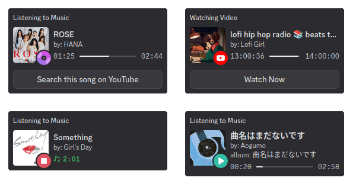

# music-discord-rpc     

<p align="center">

</p>

Cross-platform Discord rich presence for music with **album cover and progress bar support**. You can customize additional buttons, such as linking to your Last.fm profile or searching for the current song on YouTube. There's also an option to display either the music player's icon or your Last.fm avatar next to the album cover. Album covers are fetched from Last.fm, with MusicBrainz used as a fallback. The application is written in Rust.

## Supported players

### Linux

Any player or app with [MPRIS](https://wiki.archlinux.org/title/MPRIS) support. Basically nearly every music application on Linux supports MRPIS in some way so there are plenty of compatible players. Web browsers also support MPRIS so this will work even with music streaming services playing in Google Chrome or Firefox.

### MacOS

The macOS version uses [media-control](https://github.com/ungive/media-control) to retrieve information about the currently playing song. From what I understand, media-control can extract information from most if not all music players, but I cannot guarantee this 100%.

## Requirements

### Linux

Any fairly new 64-bit Linux distribution. It will probably also work on older versions of Linux but would have to be manually compiled on an older system. The optional background service and automatic startup capabilities rely on systemd or XDG Autostart.

### MacOS

It works both on Intel-based Macs and the newer ones with Apple Silicon.

## Installation

### MacOS

<details>
  <summary>Instructions</summary>

Install using Homebrew:

```sh
brew tap patryk-ku/music-discord-rpc https://github.com/patryk-ku/music-discord-rpc
brew install patryk-ku/music-discord-rpc/music-discord-rpc
```

</details>

### Debian, Ubuntu, Mint and derivatives (.deb)

<details>
  <summary>Instructions</summary>

Download the latest .deb file from the [Releases](https://github.com/patryk-ku/music-discord-rpc/releases) page.

Now double-click it from file explorer to install it using Software Manager or use this command:

```sh
sudo dpkg -i music-discord-rpc.deb
```

</details>

### Fedora, openSUSE and derivatives (.rpm)

<details>
  <summary>Instructions</summary>

Download the latest .rpm file from the [Releases](https://github.com/patryk-ku/music-discord-rpc/releases) page.

Double-click the file in your file explorer to install it using your distribution's software manager.

Alternatively, you can use the following commands:

Fedora

```sh
sudo dnf install ./music-discord-rpc.rpm
```

openSUSE

```sh
sudo zypper install music-discord-rpc.rpm
```

</details>

### Arch, Manjaro, EndeavourOS and derivatives (AUR)

<details>
  <summary>Instructions</summary>

Available in the [AUR](https://aur.archlinux.org/packages/music-discord-rpc-bin). Install with your favorite AUR helper:

```sh
yay -S music-discord-rpc-bin
```

</details>

### Void

<details>
  <summary>Instructions</summary>

This assumes using pre-cloned [xbps-src](https://github.com/void-linux/void-packages/) and installed [xtools](https://github.com/leahneukirchen/xtools) (shell helpers for xbps), available in official repos.
If you don't want to build it locally, use the 'Other Distributions' option (below)

```sh
#1. Change directory to your local clone of void-packages repo
cd /path/to/void-packages
# 2. Create package template folder for music-discord-rpc
mkdir -p srcpkgs/music-discord-rpc
# 3. Fetch template
curl https://raw.githubusercontent.com/patryk-ku/music-discord-rpc/refs/heads/main/xbps/template > srcpkgs/music-discord-rpc/template
# 4. And version checking pattern
curl https://raw.githubusercontent.com/patryk-ku/music-discord-rpc/refs/heads/main/xbps/update > srcpkgs/music-discord-rpc/update
# 5. Update checksum of music-discord-rpc with newest release
xgensum -i music-discord-rpc
# 6. Build and package
./xbps-src pkg music-discord-rpc
# 7. Install
xi music-discord-rpc
```
To update repeat the above steps. You can use `./xbps-src update-check music-discord-rpc` to check for availability of new version(s).

See the [Intro](https://xbps-src-tutorials.github.io/) to or [Manual](https://github.com/void-linux/void-packages/blob/master/Manual.md) for `xbps-src` for details about how it builds and operates.

Ping @JkktBkkt if you're experiencing an issue with building on Void.
Note that officially supported platform is x86_64 on glibc only, the rest aren't tested.

</details>

### Other Distributions

<details>
  <summary>Instructions</summary>

Download the latest executable from the [Releases](https://github.com/patryk-ku/music-discord-rpc/releases) page (just a `music-discord-rpc` file) and grant execute permissions:

```sh
curl -L -o music-discord-rpc 'https://github.com/patryk-ku/music-discord-rpc/releases/latest/download/music-discord-rpc'
chmod +x music-discord-rpc
```

This binary has no additional dependencies and should work on most distributions. So you can simply run the file in the terminal like this:

```sh
./music-discord-rpc
```

You can add the binary to your PATH or create an alias. Now the only thing left is to set it to launch automatically on startup. There are several ways to do that. If your distribution uses systemd, you can download a ready-to-use [music-discord-rpc.service](music-discord-rpc.service) file and save it to `~/.config/systemd/user/`. Then, edit the `ExecStart=/usr/bin/music-discord-rpc` line so it points to the location where you keep the binary. Once that's done, you can control the app's autostart behavior using the `enable`, `disable`, or `restart` subcommands. However, if your distribution doesn’t use systemd, you’ll need to create a service unit manually for your process manager. Alternatively, you can use [XDG Autostart](https://wiki.archlinux.org/title/XDG_Autostart) or configure it in your [desktop environment](https://wiki.archlinux.org/title/Autostarting#On_desktop_environment_startup) or [window manager’s](https://wiki.archlinux.org/title/Autostarting#On_window_manager_startup) config file, depending on what you’re using. The command `music-discord-rpc enable --xdg` will create a `.desktop` file for XDG Autostart in `$XDG_CONFIG_HOME/autostart` for you. Feel free to customize it to fit your needs.

If somehow the binary doesn't work on your distribution, there is also an `.AppImage` package available.

</details>

> [!NOTE]
> If there is no package for your distribution and you have experience creating packages for it, you can open an Issue so we can work together to add it.

## Configuration and usage

Use this command to start the service in the background and enable autostart. See the [Autostart](#autostart) section for more information.

```sh
# On Linux
music-discord-rpc enable

# On MacOS
brew services start music-discord-rpc
```

Or just directly run it in the terminal:

```sh
music-discord-rpc
```

You can change the default settings using arguments or by editing config file. Launch executable with `-h` or `--help` for aditional info:

```
music-discord-rpc --help

Usage: music-discord-rpc [OPTIONS] [COMMAND]

Commands:
  enable   Start RPC in the background and enable autostart
  disable  Stop RPC and disable autostart
  restart  Use to restart the service and reload the changed configuration file
  help     Print this message or the help of the given subcommand(s)

Options:
  -i, --interval <seconds>
          Activity refresh rate (min: 5, default: 10)
  -b, --button <name>
          Select visible buttons [possible values: yt, lastfm, listenbrainz, mprisUrl, shamelessAd]
      --lastfm-name <nickname>
          Your Last.fm nickname
      --listenbrainz-name <nickname>
          Your Listenbrainz nickname
  -r, --rpc-name <value>
          Select what will be displayed after "Listening to" (default: artist) [possible values: artist, track, none]
  -s, --small-image <name>
          Select the icon displayed next to the album cover (default: playPause) [possible values: playPause, player, lastfmAvatar, none]
      --force-player-id <player_id>
          Force a different player id to be displayed than the one actually used
      --force-player-name <player name>
          Force a different player name to be displayed than the one actually used
      --disable-mpris-art-url
          Prevent MPRIS artUrl to be used as album cover if cover is not available on Last.fm
  -l, --list-players
          Displays all available music player names and exits. Use to get your player name for -a argument
      --get-player-id
          Show ID of currently detected player. Use when requesting missing icon
  -a, --allowlist-add <Player Name>
          Get status only from given player. Use multiple times to add several players
  -w, --video-players <Player Name>
          Will use the "watching" activity. Use multiple times to add several players
      --hide-album-name
          Hide album name
      --only-when-playing
          Only send activity when media is playing
  -d, --disable-cache
          Disable cache (not recommended)
      --lastfm-api-key <api_key>
          Your Last.fm API key
      --disable-musicbrainz-cover
          Do not use MusicBrainz as a fallback source of album covers
      --debug-log
          Show debug log
      --reset-config
          Reset config file (overwrites the old file if exists)
  -h, --help
          Print help
  -V, --version
          Print version
```

### Autostart

#### Linux

There are 2 built-in ways to autostart this app: systemd and XDG Autostart:

```sh
# Systemd distributions (Ubuntu, Fedora, Arch, etc)
music-discord-rpc enable

# XDG Autostart for distrubutions without systemd (Void and others)
music-discord-rpc enable --xdg

```

The `enable` subcommand automatically reloads the systemd daemon and enables the service, `disable` will disable the service, and `restart` will restart it.

The `--xdg` flag is available for the `enable` and `disable` subcommands and creates/removes a `.desktop` file from `$XDG_CONFIG_HOME/autostart` instead.

With systemd you can check the service status with:

```sh
systemctl --user status music-discord-rpc.service
```

And check the logs with:

```sh
journalctl --user -u music-discord-rpc.service
```

Or monitor the logs in real-time with:

```sh
journalctl --user -u music-discord-rpc.service -f
```

#### MacOS

Enable app and autostart:

```sh
brew services start music-discord-rpc
```

Disable app and autostart:

```sh
brew services stop music-discord-rpc
```

Restart app:

```sh
brew services restart music-discord-rpc
```

### Config

The application will generate a configuration file at `~/.config/music-discord-rpc/config.yaml` when you run it for the first time. You can reset or regenerate it with `--reset-config`. You can also check default config file here: [config.yaml](config.yaml).

After editing the file, run this command to reload service and apply the changes:

```sh
# On Linux
music-discord-rpc restart

# On MacOS
brew services restart music-discord-rpc
```

Keep in mind that when using XDG Autostart, there's no built-in way to restart the service after changing the config. Config updates will only take effect after reboot. You can manually kill the process and restart it in the background as a workaround.

### Allowlist

To select the music players, use the `-a`,`--allowlist-add` argument or `allowlist` in the config file. This argument can be used multiple times to add more players. The order matters and the first is the most important.

arguments:

```sh
music-discord-rpc -a "VLC Media Player" -a "Chrome" -a "Any other player"
```

config:

```yaml
allowlist:
  - "VLC Media Player"
  - "Chrome"
  - "Any other player"
```

Use the `-l`, `--list-players` to get your player name.

### "Watching Video" activity

You can mark players as video players using the `-w`,`--video-players` argument or `video_players` in the config file. Then the status will be "Watching Video" and the RPC will be more suitable for videos. This argument can be used multiple times to add more players.

arguments:

```sh
music-discord-rpc -w "VLC Media Player" -w "Chrome" -w "Any other player"
```

config:

```yaml
video_players:
  - "VLC Media Player"
  - "Chrome"
  - "Any other player"
```

It's also possible to display a thumbnail or cover of the video you're watching (e.g., from YouTube), but this requires a player that provides the URL via MPRIS. There aren't many players that do this natively, but `mpv` with the `mpv-mpris` plugin will share the thumbnail of a video piped to it from `yt-dlp`. Other custom YouTube players sometimes have similar functionality. Streaming apps like Jellyfin should work too. Additionally, Chromium-based browsers or Firefox (and forks) can achieve similar functionality using a browser extension.

KDE Plasma:

- Google Chrome, Chromium, and Vivaldi: https://chromewebstore.google.com/detail/plasma-integration/cimiefiiaegbelhefglklhhakcgmhkai
- Mozilla Firefox: https://addons.mozilla.org/en-US/firefox/addon/plasma-integration/
- Microsoft Edge: https://microsoftedge.microsoft.com/addons/detail/plasma-integration/dnnckbejblnejeabhcmhklcaljjpdjeh

GNOME (not tested):

- Google Chrome, Chromium, and Vivaldi: https://chromewebstore.google.com/detail/integracja-z-gnome-shell/gphhapmejobijbbhgpjhcjognlahblep
- Mozilla Firefox: https://addons.mozilla.org/en-US/firefox/addon/gnome-shell-integration/

> [!CAUTION]
> Using this RPC with browser extensions can potentially compromise your privacy. Most videos played in the browser will be displayed as your activity, including content from sites like Instagram, FB, Twitter, etc. Even NSFW content might be displayed with thumbnails, which could result in a ban from Discord or removal from servers. You can disable thumbnail display using the `--disable-mpris-art-url` argument or by setting `disable_mpris_art_url` to true in the config file.

### "Listening to ..."

You can choose what shows up after "Listening to" on the Discord user list: artist name, song title, or just "Music" (default: artist).

arguments:

```sh
music-discord-rpc -r artist
```

config:

```yaml
rpc_name: artist
```

example:

| value     | displayed RPC                                     |
| --------- | ------------------------------------------------- |
| `artist`  | Listening to **Rick Astley**                      |
| `track`   | Listening to **Never Gonna Give You Up**          |
| `none`    | Listening to **Music**                            |

### Buttons

You can choose from available options (max 2):

- `yt` - Search this song on YouTube.
- `lasfm` - Last.fm profile.
- `listenbrainz` - Listenbrainz profile.
- `mprisUrl` - Some custom YT players, Jellyfin, mpv or browsers with extension may provide a URL to the currently playing content (see the "Watching Video" activity section for more details). When available, a "Play Now" button will be displayed for music and a "Watch Now" button for video. If the URL is not available, this button will be replaced with a `yt` button.
- `shamelessAd` - Link to the repository of this RPC.

Remember to provide your usernames for the services you want to add as buttons.

arguments:

```sh
music-discord-rpc -b yt -b lastfm --lastfm-name nickname
```

config:

```yaml
allowlist:
  - "yt"
  - "lastfm"

lastfm_name: "nickname"
```

> [!IMPORTANT]
> After Discord recent profile layout update, users cannot see their activity buttons anymore, BUT other users can see them. This is not a bug but a feature from Discord. You can make sure the buttons work by logging into an alternative account in your browser, or just by asking a friend :)

> You can request more buttons by opening an Issue.

### The icon next to the album cover

You can choose from available options: `playPause`, `player`, `lastfmAvatar`, `none`.

arguments:

```sh
music-discord-rpc -s player
```

config:

```yaml
small_image: player
```

Available music player icons: `Amberol`, `Audacious`, `Elisa`, `Finamp`, `Firefox`, `fooyin`, `GNOME Music`, `Google Chrome`, `Lollypop`, `Mozilla Firefox`, `mpv`, `Plexamp`, `Spotify`, `Strawberry`, `Tauon`, `TIDAL Hi-Fi`, `VLC Media Player`, `YouTube`, `Zen Browser`.

You can also force a different player icon and name to be displayed than the one actually used.

arguments:

```sh
music-discord-rpc --force-player-id "vlc_media_player" --force-player-name "VLC media player"
```

config:

```yaml
force_player_id: "vlc_media_player"
force_player_name: "VLC media player"
```

Icons are available for these ids: `amberol`, `audacious`, `chrome`, `elisa`, `finamp`, `firefox`, `fooyin`, `lollypop`, `mozilla_firefox`, `mozilla_zen`, `mpv`, `music`, `plexamp`, `spotify`, `strawberry`, `tauon`, `tidalhifi`, `vlc_media_player`, `youtube`.

**Missing your player icon?** Open an Issue with:

- Icon link (png, min. 512x512 resolution - Discord requirement)
- Player ID (obtainable by running `music-discord-rpc --get-player-id`)

Icons are managed through Discord Developer Portal, so no app update is needed after adding new ones.

### Flatpak Discord fix

**This fix is likely no longer necessary**, as the application typically works with Flatpak Discord without any additional steps. However, if you experience issues with Discord not detecting the rich presence, you can try this solution:

```sh
ln -sf {app/com.discordapp.Discord,$XDG_RUNTIME_DIR}/discord-ipc-0
```

If you do need to use this fix, note that it will need to be done **every reboot**. So I would also recommend adding this command to the autostart.

## System usage

As it is a very simple program its impact on computer performance is unnoticeable. Normaly it uses around **12 MiB** of RAM but even less than **6 MiB** when fetching album covers only from cache.

If not disabled, the program stores the cache in `$XDG_CACHE_HOME/music-discord-rpc/` or `$HOME/.cache/music-discord-rpc/`. The application caches only image URLs from last.fm, not the images themselves, keeping the cache size small.

## Compile from source

1. Install Rust and Cargo using instructions from [Rust site](https://www.rust-lang.org/).
2. Clone the repository.
   ```sh
   git clone 'https://github.com/patryk-ku/music-discord-rpc'
   cd music-discord-rpc
   ```
3. (Optional) Rename `.env.example` to `.env` and insert here your last.fm API key. You can easily get it [here](https://www.last.fm/pl/api). Do this if you want to embed the API key in the binary. If you don't, you can provide it later via argument or config file.
   ```sh
   mv .env.example .env
   echo LASTFM_API_KEY=key_here > .env
   ```
4. Compile executable using Cargo.
   ```sh
   cargo build --release
   ```
5. The compiled executable file location is: `target/release/music-discord-rpc`.

## Changelog

[CHANGELOG.md](CHANGELOG.md)

## FAQ

<details>
  <summary>Can I Use local image files for RPC cover art instead of Last.fm/MusicBrainz?</summary>

No. It's not possible to use local images for Discord RPC, only URLs to images available on the internet are supported by Discord for now. That's why I have to use cover arts from Last.fm and MusicBrainz.

</details>

<details>
  <summary>An incorrect album image is being displayed.</summary>

MusicBrainz often returns incorrect images, but it is only used if finding a cover on Last.fm fails. So, you can either disable MusicBrainz as a cover source in the config and wait for someone to upload the correct album cover to Last.fm, or you can upload it yourself.

Then, clear the album cache.

</details>

<details>
  <summary>How to clear album cache?</summary>

If not disabled, the program stores the cache in `$XDG_CACHE_HOME/music-discord-rpc/` or `$HOME/.cache/music-discord-rpc/`. Just delete file inside this directory and restart service.

For most users, the following commands should work:

```sh
rm ~/.cache/music-discord-rpc/album_cache.db
music-discord-rpc restart
```

</details>

<details>
  <summary>There is no icon for my music player/video player/streaming service, etc.</summary>

Open an Issue with:
- Icon link (png, min. 512x512 resolution - Discord requirement)
- Player ID (obtainable by running `music-discord-rpc --get-player-id`)

</details>

<details>
  <summary>How are new player icons added without releasing a new binary?</summary>

Icons are managed through Discord Developer Portal, so no app update is needed after adding new ones. See [here](https://github.com/patryk-ku/music-discord-rpc/issues/29#issuecomment-2936507734).

</details>

<details>
  <summary>Can you create a package for my Linux distribution?</summary>

Of course! If you're willing to help, feel free to open a new Issue so we can work together on adding it.

</details>

<details>
  <summary>I have an idea for a feature.</summary>

Feel free to open a new Issue and share your idea! I'm generally open to adding new features, and we can discuss what is possible to implement.

</details>

<details>
  <summary>The macOS version doesn't work correctly / displays data incorrectly.</summary>

Before opening an issue, please check if `media-control get -h` returns data correctly, as the macOS version relies on it and my program only reads its output. If there's a problem with [media-control](https://github.com/ungive/media-control), open a new issue in its repository, if not, open one here.

</details>

## Credits

I wouldn't have been able to create this without two fantastic crates: [mpris-rs](https://github.com/Mange/mpris-rs) and [discord-rich-presence](https://github.com/vionya/discord-rich-presence). The macOS version wouldn't be possible without [media-control](https://github.com/ungive/media-control). Implementing these features myself would have been beyond my current skills. A huge thank you to their creators.

Any trademarks, featured track metadata, artwork and coverart in banner, music player icons and streaming service logos belong to their respective owners.
